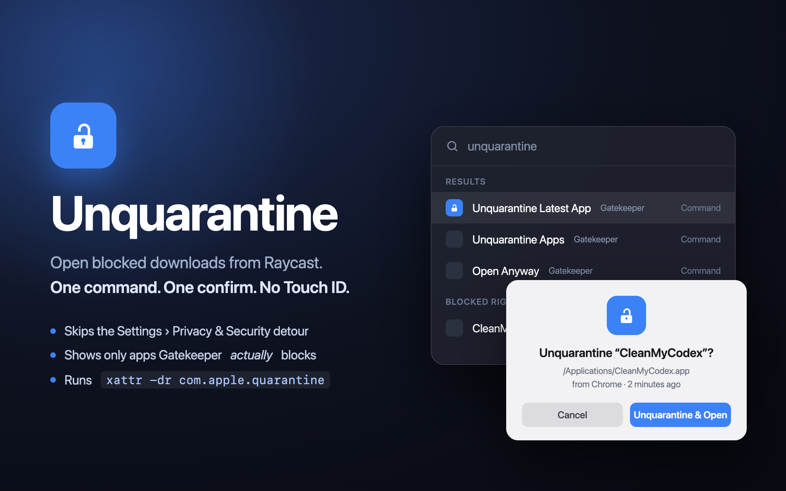
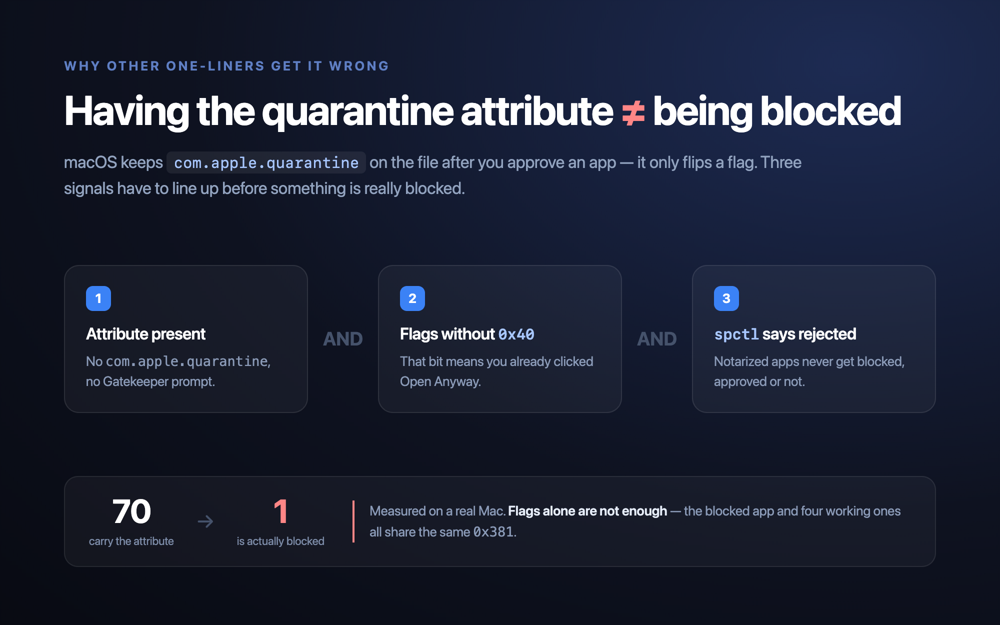

<div align="center">



# Unquarantine

**在 Raycast 里放行被拦下的下载。一条命令，一次确认，不用 Touch ID。**

[English](README.md) · 简体中文

</div>

---

从网上下载一个未签名的 App，拖进 `/Applications`，双击——macOS 告诉你「无法验证开发者」。官方的解法是一段绕路：打开系统设置，找到「隐私与安全性」，翻到页面底部点 **Open Anyway**，再确认一次，最后还要按 Touch ID。

这个 Raycast 扩展把整件事压缩成一次搜索。

## 命令

| 命令                              | 作用                                                                                                                    |
| --------------------------------- | ----------------------------------------------------------------------------------------------------------------------- |
| **Unquarantine Latest App**       | 最省事的一条。取 24 小时内下载、且真正被 Gatekeeper 拦住的那个 App，问一次，确认即解除。不弹系统弹窗，不需要 Touch ID。 |
| **Unquarantine Apps**             | 列表浏览：默认只看会被拦住的，也可以切换查看所有还带着隔离属性的文件。                                                  |
| **Unquarantine Finder Selection** | 对访达中当前选中的文件解除隔离——刚把 App 拖进 `/Applications` 时最顺手。                                                |
| **Open Anyway**                   | 想走苹果原本的流程？打开「隐私与安全性」并滚到 Security 分区，同时报出被拦的是哪个 App。按钮由你自己点。                |
| **Open Security Settings**        | 单纯跳到 Security 分区，不需要辅助功能权限。                                                                            |

前三条命令底层就是 `xattr -dr com.apple.quarantine <path>`。你自己拥有的 App 不需要密码；遇到权限不足会自动回退到提权执行，由 macOS 弹框向你要授权。

## 安装

没有上架 Raycast Store，需要从源码装。大概一分钟，不需要懂扩展开发。

**准备：** macOS、[Raycast](https://raycast.com)、Node.js 22+ 和 [pnpm](https://pnpm.io) 11+（`brew install node pnpm`）。

**1. 构建**

```bash
git clone https://github.com/chen86860/raycast-unquarantine.git
cd raycast-unquarantine
pnpm install
pnpm dev
```

**2. 等它跑完，然后退出**

`pnpm dev` 会把扩展装进 Raycast，并作为文件监听常驻。看到 `built extension successfully` 之后按 <kbd>Ctrl</kbd>+<kbd>C</kbd> 退出即可。**扩展会保留**——监听只是给改代码用的，命令本身不依赖它。

**3. 开始用**

打开 Raycast 输入 `unquarantine`，五条命令都在。日常用得最多的是 `Unquarantine Latest App`。

> [!TIP]
> 给它设个快捷键。在「Raycast Settings › Extensions › Unquarantine」里给 **Unquarantine Latest App** 配一个别名（比如 `unq`）或热键，之后放行一个新下载的 App 就是：热键、回车。这个面板里也放着本扩展的设置项。

不想用终端里的监听进程？Raycast 自带 **Import Extension** 命令，选中本地文件夹即可完成同样的注册——但仍需先跑 `pnpm install`。想卸载用 **Manage Extensions**。

<details>
<summary>可选：授予辅助功能权限</summary>

只有 **Open Anyway** 需要它，而且只用来从设置窗口里读出被拦 App 的名字。在「系统设置 › 隐私与安全性 › 辅助功能」里勾上 Raycast 即可。不授权也不影响使用——命令照样打开正确的分区，只是说不出是哪个 App 被拦。

</details>

<details>
<summary>验证装好了没</summary>

跑一次 **Unquarantine Apps**。如果当前没有被拦的 App，列表是空的——这是正确结果，不是出错。把搜索栏里的下拉切到第二项，就能看到所有被 macOS 打过隔离标记的 App，每条都标着「会被拦」或「已放行」。

</details>

## 设置项

| 设置               | 默认 | 作用                                                                    |
| ------------------ | ---- | ----------------------------------------------------------------------- |
| 解除后自动打开     | 开   | 解除隔离后直接启动该 App                                                |
| 额外扫描目录       | –    | 逗号分隔，在 `/Applications`、`~/Applications`、`~/Downloads` 之外追加  |
| 解除隔离后重新签名 | 关   | 额外执行 `codesign --force --deep --sign -`，用于仍提示「已损坏」的 App |

## 「有隔离属性」不等于「会被拦」



这是大多数一行脚本会踩的坑：App 被放行之后，`com.apple.quarantine` 属性**仍然留在文件上**，只是标志位加了一位。所以光看「有没有这个属性」什么也说明不了——开发这个扩展的机器上，70 个带属性的项里，实际被拦的只有 1 个。

三个条件必须同时成立：

1. **属性存在。** 没有属性就不会有 Gatekeeper 拦截。
2. **标志位不含 `0x40`。** 这一位记录的是「你已经点过 Open Anyway」。
3. **`spctl --assess` 判定 rejected。** 公证过的 App 无论放行与否都不会被拦。

> [!WARNING]
> 不要用 `0x80` 判断。它看着像「评估通过」，但被拦住的 App 同样带着它——一个被拦的 App 和四个能正常打开的 App，标志位都是 `0x381`。只有上面三条组合起来才可靠。

扫描开销很小：先用标志位筛（本机 70 个只剩 8 个），再对剩下的跑 `spctl`，整体约 2 秒。

## 两条路的区别

**直接清掉属性** —— `Unquarantine Latest App` 走的路。删掉 `com.apple.quarantine`，Gatekeeper 下次就不会再问。一个 Raycast 确认框搞定，不弹系统警告，不需要 Touch ID。

它只看**最近 24 小时内下载**、且真正会被拦的 `.app`，没有下载时间戳的一律排除。什么都没匹配上就会提示没有可解锁的 App——更早的东西交给 `Unquarantine Apps` 手动挑。

**走苹果的流程** —— `Open Anyway` 支持的路。系统设置 → Open Anyway → 二次确认 → Touch ID。慢一些，但 macOS 会留下正式的放行记录。这条命令只负责打开和定位，绝不替你点击。

<details>
<summary>被拦的 App 是怎么识别出来的</summary>

系统设置里的 Open Anyway 是个没有 accessibility title 的 SwiftUI 按钮，没法按名字找到。只能靠它旁边那句提示——_"X" was blocked to protect your Mac._——来定位，App 名字也是从这句话里解析出来的。

这条提示只在你**刚尝试打开过**被拦的 App 之后才出现，退出系统设置就会被清掉。提示不在时，命令就只是把你停在 Security 分区。

</details>

## 注意

隔离属性是 Gatekeeper 的一道真防线。只对自己确认来源可信的 App 使用——这个扩展让放行更快，但不会让一个不可信的 App 变得安全。每条命令在动手之前都会先报出 App 名字和下载来源。

## 开发

```bash
pnpm dev     # 监听模式，热重载进 Raycast
pnpm build   # 类型检查 + 打包
pnpm lint    # Raycast lint 规则
```

`src/lib/quarantine.ts` 负责扫描与解除，`src/lib/open-anyway.ts` 负责设置窗口的查找。每条命令对应 `src/` 下的一个文件。

## 许可

MIT
